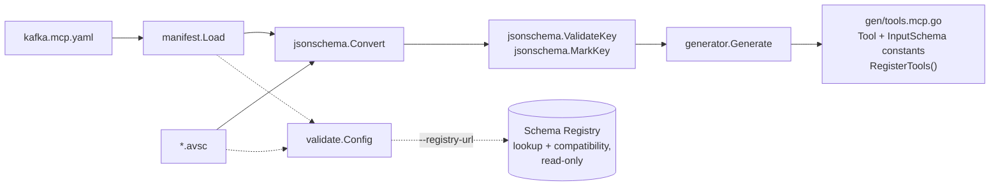
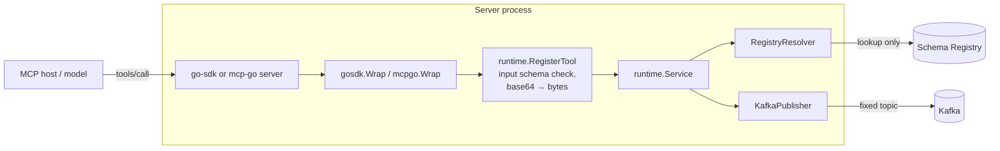
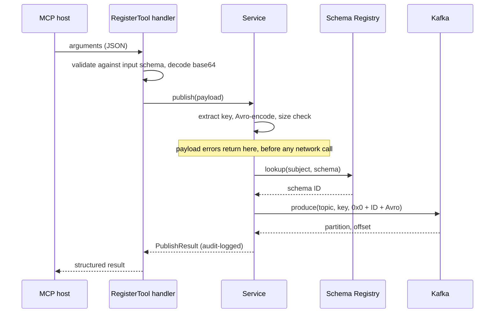

# kafka-avro-mcp

[](https://github.com/dipjyotimetia/kafka-avro-mcp/actions/workflows/ci.yml)
[](LICENSE)
[](https://pkg.go.dev/github.com/dipjyotimetia/kafka-avro-mcp)

`kafka-avro-mcp` compiles an Avro event contract plus an explicit Kafka/MCP overlay into safe, fixed-topic [MCP](https://modelcontextprotocol.io) producer tools for Go.

You describe which events a model may publish; the generator emits Go code that registers one MCP tool per event. Each tool validates its arguments against a JSON Schema derived from the Avro schema, encodes the record in Avro, and produces it to a topic fixed at build time, using the Confluent wire format.

## Contents

- [Features](#features)
- [Installation](#installation)
- [Quick start](#quick-start)
- [Manifest reference](#manifest-reference)
- [Supported Avro subset](#supported-avro-subset)
- [Runtime behaviour](#runtime-behaviour)
- [Configuration](#configuration)
- [Architecture](#architecture)
- [Development](#development)
- [Contributing](#contributing)
- [Security](#security)
- [License](#license)

## Features

- **Static, not dynamic.** Topics, subjects, key fields and schemas are baked into generated constants. A model cannot choose a topic or discover new ones.
- **Strict input validation.** Every tool enforces its generated input schema itself, rejects unknown fields, and checks `int`/`long` ranges before anything is encoded.
- **Read-only Schema Registry.** Schemas are looked up, never registered. An unregistered or mismatched schema blocks publication.
- **SDK-neutral.** Adapters for the official [`modelcontextprotocol/go-sdk`](https://github.com/modelcontextprotocol/go-sdk) and [`mark3labs/mcp-go`](https://github.com/mark3labs/mcp-go) live in separate packages, so you compile only the SDK you use.
- **Safe error reporting.** Payload errors go back to the model so it can correct itself; broker and registry errors are logged, never leaked into tool results.
- **Audit trail.** Every successful publish is logged with tool, topic, partition, offset and schema ID, never the payload.
- **CI gate.** `validate` checks contracts locally and, optionally, against a live Schema Registry for presence and compatibility.

## Installation

Install the code generator with Homebrew (macOS, Linux):

```bash
brew install dipjyotimetia/tap/avro-gen-go-mcp
```

Or with Go (1.27 or later):

```bash
go install github.com/dipjyotimetia/kafka-avro-mcp/cmd/avro-gen-go-mcp@latest
```

Or download a pre-built archive for your OS and architecture from the [latest release](https://github.com/dipjyotimetia/kafka-avro-mcp/releases/latest) and put `avro-gen-go-mcp` on your `PATH`. Check the install with `avro-gen-go-mcp version`.

Generated code imports this module's runtime, so the module hosting your MCP server needs Go 1.27 or later.

Add the runtime to the module that hosts your MCP server:

```bash
go get github.com/dipjyotimetia/kafka-avro-mcp
```

## Quick start

A complete, runnable version of these steps lives in [`examples/orders`](examples/orders).

### 1. Write an Avro schema

```json
{
  "type": "record",
  "name": "OrderCreated",
  "namespace": "orders.v1",
  "fields": [
    {"name": "orderId", "type": "string"},
    {"name": "customerId", "type": "string"},
    {"name": "amount", "type": "double"}
  ]
}
```

### 2. Describe the tool in a manifest

```yaml
# kafka.mcp.yaml
apiVersion: mcp.kafka/v1alpha1
package: events
events:
  - name: order_created
    schema: order-created.avsc      # relative to this file
    kafka:
      topic: orders.created
      subject: orders.created-value
      key:
        field: orderId
    mcp:
      tool: publish_order_created
      description: Publish an OrderCreated domain event.
```

### 3. Validate and generate

```bash
avro-gen-go-mcp validate --config kafka.mcp.yaml
avro-gen-go-mcp generate --config kafka.mcp.yaml --out ./gen
```

`generate` writes `gen/tools.mcp.go`, containing, per event, a `runtime.Tool` and its JSON input schema named after the PascalCased tool (`PublishOrderCreatedTool`, `PublishOrderCreatedInputSchema`), plus a single `RegisterTools` function.

### 4. Wire it into a server

```go
import (
    "context"

    "github.com/dipjyotimetia/kafka-avro-mcp/pkg/runtime"
    "github.com/dipjyotimetia/kafka-avro-mcp/pkg/runtime/gosdk"
    "github.com/modelcontextprotocol/go-sdk/mcp"
    "github.com/twmb/franz-go/pkg/kgo"

    events "example.com/yourapp/gen" // the generated package
)

func run(ctx context.Context) error {
    producer, err := kgo.NewClient(kgo.SeedBrokers("localhost:9092"))
    if err != nil {
        return err
    }
    defer producer.Close()

    // URL and user fall back to $SCHEMA_REGISTRY_URL / $SCHEMA_REGISTRY_USER;
    // the password is read only from $SCHEMA_REGISTRY_PASSWORD.
    registry, err := runtime.NewRegistryClient("http://localhost:8081", "")
    if err != nil {
        return err
    }

    service := runtime.NewService(
        &runtime.RegistryResolver{Client: registry},
        runtime.KafkaPublisher{Client: producer},
    )

    server := mcp.NewServer(&mcp.Implementation{Name: "orders", Version: "0.1.0"}, nil)
    events.RegisterTools(gosdk.Wrap(server), service) // or mcpgo.Wrap for mcp-go
    return server.Run(ctx, &mcp.StdioTransport{})
}
```

See [`examples/orders/server/main.go`](examples/orders/server/main.go) for a production-shaped version with TLS, SASL and stderr logging.

### 5. Run the example

The bundled example serves the orders tools over stdio. The schemas must already be registered under the subjects the manifest names.

```bash
KAFKA_BROKERS=localhost:9092 \
SCHEMA_REGISTRY_URL=http://localhost:8081 \
go run ./examples/orders/server
```

## Manifest reference

| Field | Required | Description |
|---|---|---|
| `apiVersion` | yes | Must be `mcp.kafka/v1alpha1`. |
| `package` | yes | Go package name of the generated file. Must be a valid identifier and not `main`. |
| `events[].name` | yes | Unique event name. |
| `events[].schema` | yes | Path to the `.avsc` file, relative to the manifest. |
| `events[].kafka.topic` | yes | Fixed destination topic; must be a legal Kafka topic name. |
| `events[].kafka.subject` | yes | Schema Registry subject the schema is looked up under; must be URL-safe. |
| `events[].kafka.key.field` | yes | Top-level, non-null Avro `string` field without a default, used as the record key. |
| `events[].mcp.tool` | yes | Unique MCP tool name matching `^[a-z_][a-z0-9_-]{0,63}$`. Its PascalCase form must be a unique Go identifier. |
| `events[].mcp.description` | no | Tool description shown to the model. |

## Supported Avro subset

| Supported | Intentionally unsupported |
|---|---|
| Record roots, primitives, nested and recursive records, arrays, maps, enums, nullable unions | `fixed`, logical types defined by the Avro specification (1.10–1.12), non-nullable multi-branch unions |

Also out of scope for V1: caller-controlled topics, schema registration, headers, consumer tools and dynamic discovery.

As the Avro specification requires, an unknown `logicalType`, or one on the wrong underlying type, is ignored and the field is treated as its underlying type. Only the logical types the specification defines are refused.

How Avro maps to the advertised JSON Schema (2020-12):

- A field is optional only when the Avro schema gives it a default. Being nullable is not enough, because the encoder still needs a value.
- `bytes` is advertised and accepted as base64, then decoded before encoding.
- `int` and `long` advertise their 32/64-bit range, so an overflow fails validation rather than encoding.
- The key field is marked `minLength: 1`.
- Named types become `$defs` keyed by their Avro full name.

## Runtime behaviour

### Input validation

`RegisterTool` enforces the generated input schema itself rather than relying on the host SDK. The official go-sdk validates only through its generic `AddTool`, and `mcp-go` only when the server opts into `WithInputSchemaValidation`, so arguments outside the advertised schema would otherwise reach the encoder, and an unknown field would be silently dropped rather than rejected.

### Publishing

Each tool call becomes one Kafka record:

1. Extract the key field.
2. Avro-encode the payload and check its size.
3. Look up the schema ID for the manifest subject (lookup only; nothing is registered).
4. Produce `0x0 + schema ID + Avro payload` to the fixed topic.

Payload checks run before the registry lookup, so a registry outage never masks them. Publish tools are marked side-effecting.

### Service options

| Option | Default | Purpose |
|---|---|---|
| `runtime.WithMaxMessageBytes` | 1 MiB | Ceiling on the produced record (wire header + Avro payload + key). |
| `runtime.WithPublishTimeout` | 30s | Bound on each publish, registry lookup included. |
| `runtime.WithLogger` | `slog.Default()` | Destination for failure detail and the publish audit log. |

Kafka additionally charges per-record batch overhead, so the size guard is a sanity check rather than an exact predictor of the broker's `max.message.bytes`.

### Errors

Failures are split by who can act on them. Broker and registry errors can carry hostnames and internal addresses, so they never reach the model.

| Failure | Returned to the model | Logged |
|---|---|---|
| Schema violation, missing key, encode error, size limit (`runtime.PayloadError`) | Full message | — |
| Registry or broker failure | "publishing to `<topic>` failed" | Full error, with tool, topic and subject |
| Success | Topic, partition, offset, schema ID, timestamp | Info audit line, without the payload |

## Configuration

### CLI

```text
avro-gen-go-mcp generate --config <manifest> --out <dir>
avro-gen-go-mcp validate --config <manifest> [--registry-url <url>] [--registry-user <user>]
```

With `--registry-url`, `validate` also confirms that each subject already holds the schema and that it is compatible with the subject's latest version. It never registers anything, so it is safe to run in CI:

```bash
avro-gen-go-mcp validate --config kafka.mcp.yaml --registry-url https://registry.example --registry-user ci
```

### Environment variables

| Variable | Used by | Description |
|---|---|---|
| `SCHEMA_REGISTRY_URL` | CLI, example server | Registry URL. Fallback for `--registry-url`; required by the server. |
| `SCHEMA_REGISTRY_USER` | CLI, example server | Basic-auth user. Fallback for `--registry-user`. |
| `SCHEMA_REGISTRY_PASSWORD` | CLI, example server | Basic-auth password. |
| `KAFKA_BROKERS` | example server | Comma-separated seed brokers (required). |
| `KAFKA_TLS` | example server | `true` to dial brokers over TLS with the system roots. |
| `KAFKA_SASL_MECHANISM` | example server | `PLAIN`, `SCRAM-SHA-256` or `SCRAM-SHA-512`. |
| `KAFKA_SASL_USER`, `KAFKA_SASL_PASSWORD` | example server | SASL credentials, required when a mechanism is set. |

The registry password is read only from `$SCHEMA_REGISTRY_PASSWORD`, never from a flag, since command-line arguments are visible to anything that can list processes.

## Architecture

Work happens in two phases. At build time the CLI turns a manifest and its Avro schemas into Go constants. At run time those constants are registered as MCP tools, and each tool call becomes one Kafka record.

### Build time



`validate` runs the same checks as `generate`, so a manifest that validates will always generate.

### Run time



The generated `RegisterTools` depends only on `runtime.MCPServer`.

### One tool call



### Packages

| Package | Role |
|---|---|
| `cmd/avro-gen-go-mcp` | CLI: `generate` and `validate`. |
| `pkg/manifest` | Loads and validates `kafka.mcp.yaml`. |
| `pkg/jsonschema` | Converts the supported Avro subset to JSON Schema 2020-12. |
| `pkg/generator` | Emits the generated Go file. |
| `pkg/validate` | Local validation and the read-only Schema Registry check. |
| `pkg/runtime` | SDK-neutral core used by generated code: `Service`, `RegisterTool`, `KafkaPublisher`, `RegistryResolver`. |
| `pkg/runtime/gosdk`, `pkg/runtime/mcpgo` | Adapters for the two MCP SDKs. |

## Development

```bash
go build ./...
go test -race ./...
go vet ./...
gofmt -l ./cmd ./pkg ./examples ./integration   # must print nothing
golangci-lint run
```

`examples/orders/gen/tools.mcp.go` is generated and checked in; CI regenerates it and fails on any diff. After changing the generator, the JSON Schema converter or the example schemas, regenerate it rather than editing it by hand:

```bash
go run ./cmd/avro-gen-go-mcp generate --config examples/orders/kafka.mcp.yaml --out examples/orders/gen
```

### Integration tests

The Redpanda integration test is a separate Go module, so testcontainers never enters the library's dependency graph. It needs a running Docker daemon:

```bash
cd integration && go test ./...
```

## Contributing

Issues and pull requests are welcome. See [CONTRIBUTING.md](CONTRIBUTING.md) for the development workflow, and note that this project follows a [Code of Conduct](CODE_OF_CONDUCT.md).

## Security

Please report vulnerabilities privately, as described in [SECURITY.md](SECURITY.md), rather than in a public issue.

## License

[MIT](LICENSE)
