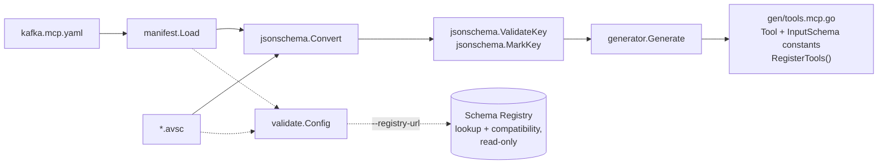
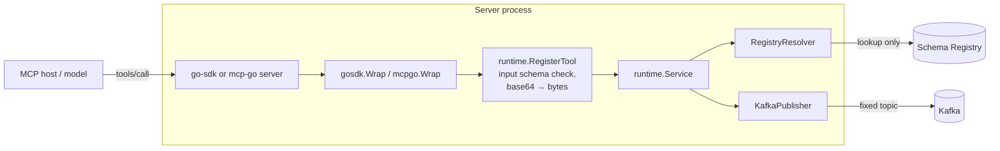
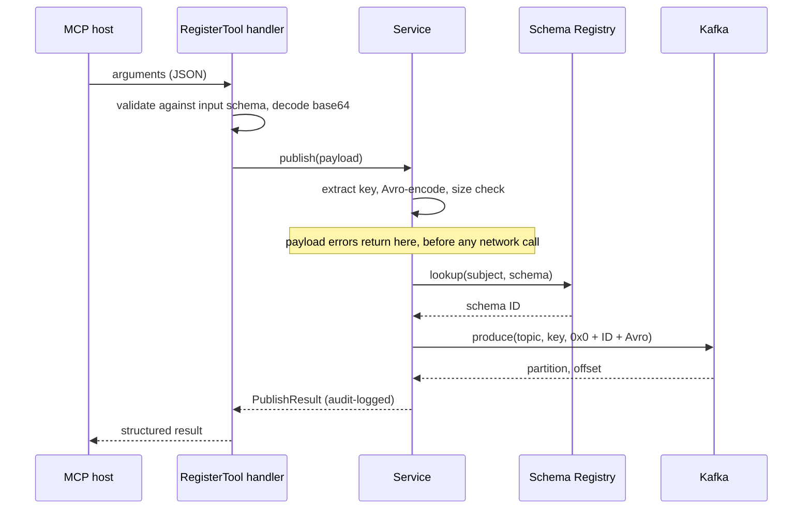

# kafka-avro-mcp

`kafka-avro-mcp` compiles an Avro event contract plus an explicit Kafka/MCP overlay into safe, fixed-topic MCP producer tools.

```bash
go run ./cmd/avro-gen-go-mcp generate \
  --config examples/orders/kafka.mcp.yaml \
  --out ./gen
```

Generated packages expose one adapter-neutral `RegisterTools` entry point. Wrap an official `modelcontextprotocol/go-sdk` server with `gosdk.Wrap` (`pkg/runtime/gosdk`), or an `mcp-go` server with `mcpgo.Wrap` (`pkg/runtime/mcpgo`) — each adapter is its own package, so you compile only the SDK you use — then supply a `runtime.Service` built from `runtime.RegistryResolver` and `runtime.KafkaPublisher`. `examples/orders/server` is that wiring end to end, over stdio:

```bash
KAFKA_BROKERS=localhost:9092 \
SCHEMA_REGISTRY_URL=http://localhost:8081 \
go run ./examples/orders/server
```

Validate local contracts before generation or use a read-only Schema Registry gate in CI:

```bash
avro-gen-go-mcp validate --config kafka.mcp.yaml
avro-gen-go-mcp validate --config kafka.mcp.yaml --registry-url https://registry.example
avro-gen-go-mcp validate --config kafka.mcp.yaml --registry-url https://registry.example --registry-user ci
```

`--registry-url` and `--registry-user` fall back to `$SCHEMA_REGISTRY_URL` and `$SCHEMA_REGISTRY_USER`. The password is read only from `$SCHEMA_REGISTRY_PASSWORD`, never from a flag, since arguments are visible to anything that can list processes. The example server reads the same three variables, and optionally `KAFKA_TLS=true` plus `KAFKA_SASL_MECHANISM` (`PLAIN`, `SCRAM-SHA-256` or `SCRAM-SHA-512`) with `KAFKA_SASL_USER` and `KAFKA_SASL_PASSWORD` for a secured broker.

V1 supports record roots, primitives, nested records, arrays, maps, enums, and nullable unions. It intentionally does not permit caller-controlled topics, schema registration, headers, consumer tools, dynamic discovery, logical types, `fixed`, or non-nullable multi-branch unions. As the Avro specification requires, an unknown `logicalType`, or one on the wrong underlying type, is ignored and the field treated as its underlying type; only the logical types the specification defines (1.10 through 1.12) are refused.

`RegisterTool` enforces the generated input schema itself rather than relying on the host SDK: the official go-sdk validates only through its generic `AddTool`, and `mcp-go` only when the server opts into `WithInputSchemaValidation`, so arguments outside the advertised schema would otherwise reach the encoder — and an unknown field would be silently dropped rather than rejected. Three consequences are worth knowing: a field counts as optional only when the Avro schema gives it a default (being nullable is not enough, because the encoder still needs a value), an Avro `bytes` field is advertised and accepted as base64, then decoded before encoding, and `int`/`long` fields advertise their 32/64-bit range so an overflow fails validation rather than encoding.

Each manifest event declares a Schema Registry subject explicitly. At runtime the resolver performs a lookup only: an unregistered/mismatched schema prevents publication. Publish tools are marked side-effecting, use fixed manifest topics, and default to a 1 MiB ceiling on the produced record (wire header + Avro payload + key); callers can lower or raise it through `runtime.WithMaxMessageBytes`. Each publish, registry lookup included, is bounded by a 30-second timeout, adjustable through `runtime.WithPublishTimeout`. Kafka additionally charges per-record batch overhead, so the guard is a sanity check rather than an exact predictor of the broker's `max.message.bytes`.

Failures are split by who can act on them. A payload problem — a key field missing, a record over the size ceiling, a value the encoder rejects — goes back to the caller in full so a model can correct itself. These checks run before the registry lookup, so a registry outage never masks them. A broker or registry failure can carry hostnames and internal addresses, so the tool result names only the topic and the detail goes to the `runtime.WithLogger` logger (`slog.Default()` otherwise). Every successful publish is also logged there at Info with its tool, topic, partition, offset and schema ID — never its payload — as an audit trail of what a model caused.

## Architecture

Work happens in two phases. At build time the CLI turns a manifest and its Avro schemas into Go constants. At run time those constants are registered as MCP tools, and each tool call becomes one Kafka record.

### Build time



`validate` runs the same checks as `generate`, so a manifest that validates will always generate. With `--registry-url` it also confirms that each subject already holds the schema and that the schema is compatible with the subject's latest version. It never registers anything.

### Run time



The generated `RegisterTools` depends only on `runtime.MCPServer`. The adapters live in their own packages, so a server compiles only the MCP SDK it uses.

### One tool call



### Errors

| Failure | Returned to the model | Logged |
|---|---|---|
| Schema violation, missing key, encode error, size limit (`runtime.PayloadError`) | Full message | — |
| Registry or broker failure | "publishing to `<topic>` failed" | Full error, with tool, topic and subject |
| Success | Topic, partition, offset, schema ID, timestamp | Info audit line, without the payload |

## Integration test

The Redpanda integration test is a separate module, so testcontainers never enters the library's dependency graph. Run it with a Docker daemon available: `cd integration && go test ./...`.
